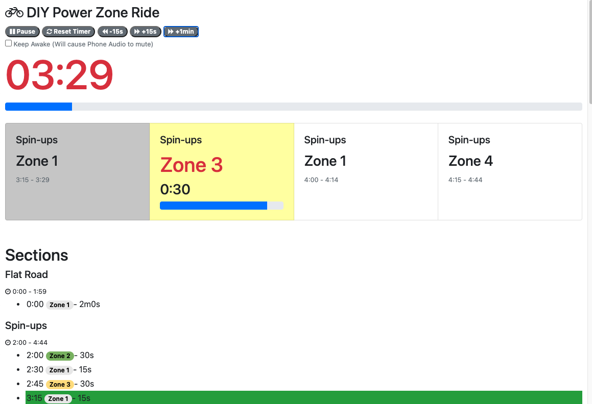
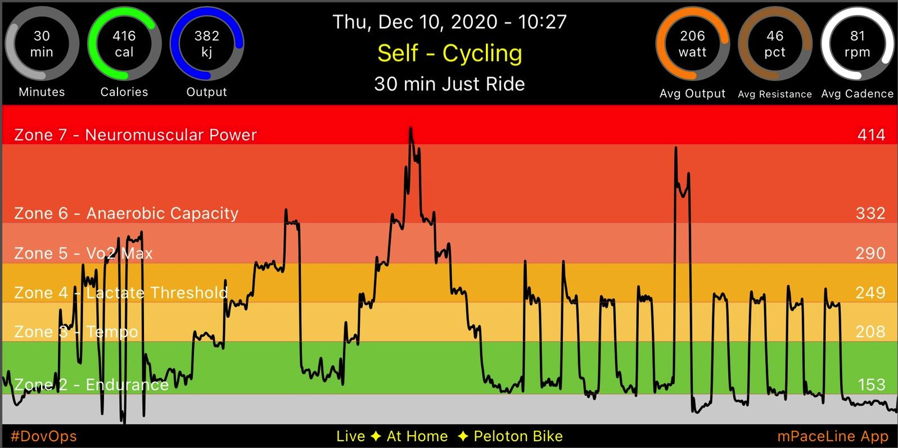

# Custom PowerZone Guide
Simple tool to help you display a guide to ride a custom powerzone ride.

I created this quick prototype help me do a custom 'Just ride' in order to draw a Hanuka Menorah and Xmas tree on a 30 minute PZ-inspired ride.  I simply casted this page from my laptop to the TV and played a spotify playlist.

You can easily [launch this page from GitHub directly](https://pelo-tech.github.io/custom-powerzone/) or modify this code for your own PZ rides.

Screenshots below of the tool and the ride chart built into it at the moment.

Enjoy, and Happy Holidays!

## Known Issue
There's an option to 'Avoid phone going to sleep' which needs to be activated before starting the timer. This could end up utilizing the media player of the browser, which -- if you're on your smartphone -- will mute the audio of Spotify or any other music player when you use this feature.    As a workaround, I used my macbook to cast to my TV, and zoomed in a bit before hitting play, and I used spotify as well as this browser without any issues.

## Screenshots

